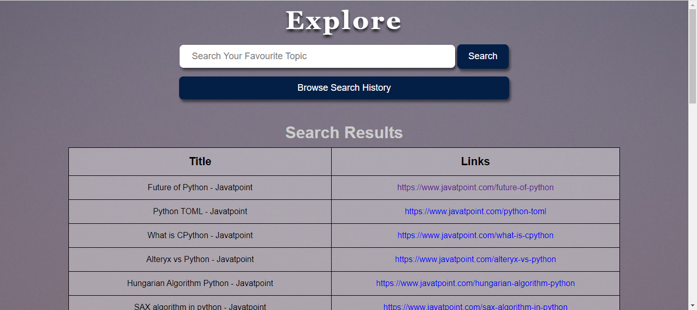
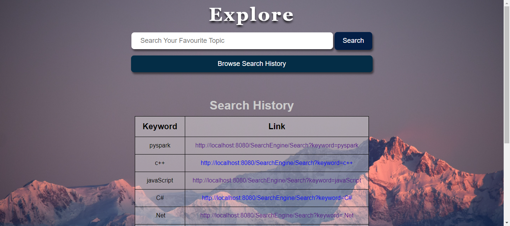

# Explore - A Search Engine 🚀

## Overview

Welcome to Explore - A Search Engine website where we fetch some data from a website and shows the result to the user. We can also show the search history that a user searched throught the search engine.

## Table of Contents

1. [Introduction](#introduction "Introduction")
2. [Technologies](#technologies "Technologies")
3. [Description](#description "Description")
4. [Website Images](#website-images)

## Introduction

A Search Engine is a powerful tool that enables users to find information and other content on the internet. In this project, we aim to build a simple search engine from scratch and gain a deeper understanding of how it functions behind the scenes. The search engine will utilize Term Frequencies (TFs) in its web crawling process using indexer, enabling efficient data retireival.

## Technologies

* FrontEnd - HTML, CSS, JSP
* BackEnd - Java Servlets
* Database - MySQL
* Others - IntelliJ IDEA, Maven Archtype, Tomcat Server, JDBC(ConnectorJ)

## Description

**A.** The primary components of our search engine projeect are the fronend, backend, and database.

* The frontend is responsible for the user interface, where users can interact with the search engine through a search bar and search button.
* The backend handles the server-side operations, processing user requests, and generating appropriate responses.
* The database stores and manages the data that the search engine will use to retreive results.

**B.** The frontend design includes a web application with a simple search bar and a search button. When users input their queries and click the search button, the backend processes the search request and retreives the top 30 results using Ranking Algorithm based on the user's query. The search history of users is also displayed, allowing them to keep track of their previous searches.

**C.** The Search Engine will follow the client-server model, where the frontend (client) sends requests to the backend (server), which processes these requests and generates appropriate responses. This relationship can be linked to a customer interacting with a waiter in a restaurant, where the customer places an order, and the waiter conveys it to the kitchen (backend) for preparation.

**D.** A significant part of the project involves implementing a web crawler. A web crawler is a bot that automatically navigates through web pages, retreiving data to populate the database used by the search engine. The web crawler uses an algorithm called Limited Depth-First Search (DFS) to crawl through web pages systematically.

**E.** With the project's web application design, web crawler implementation, and database setup, we aim to create an efficient search engine that can retreive relevant search results based on user queries and provide a seamless user experience.

## Website Images

Main Page:

Search Page:

History Page:

